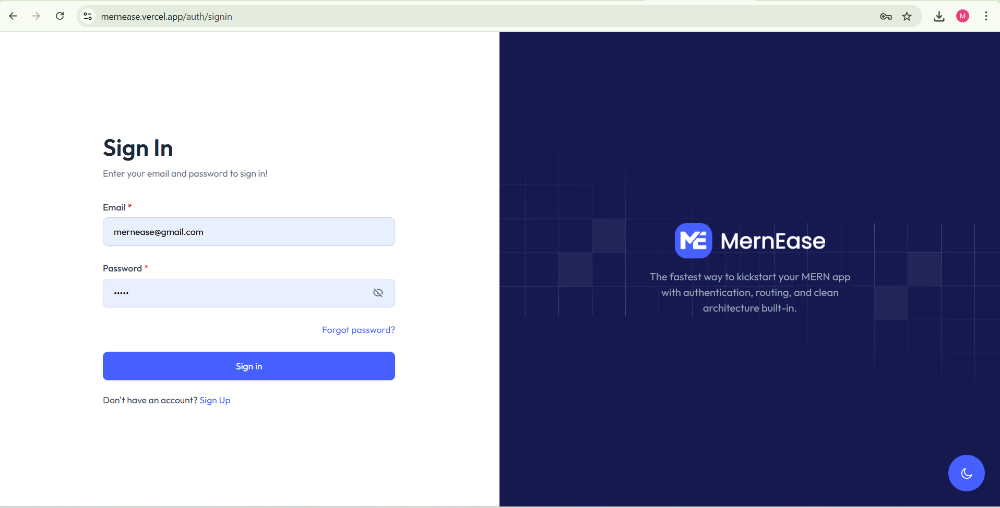
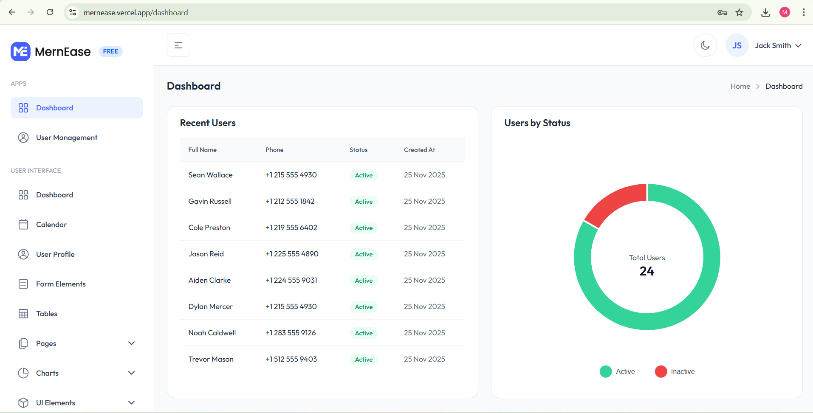
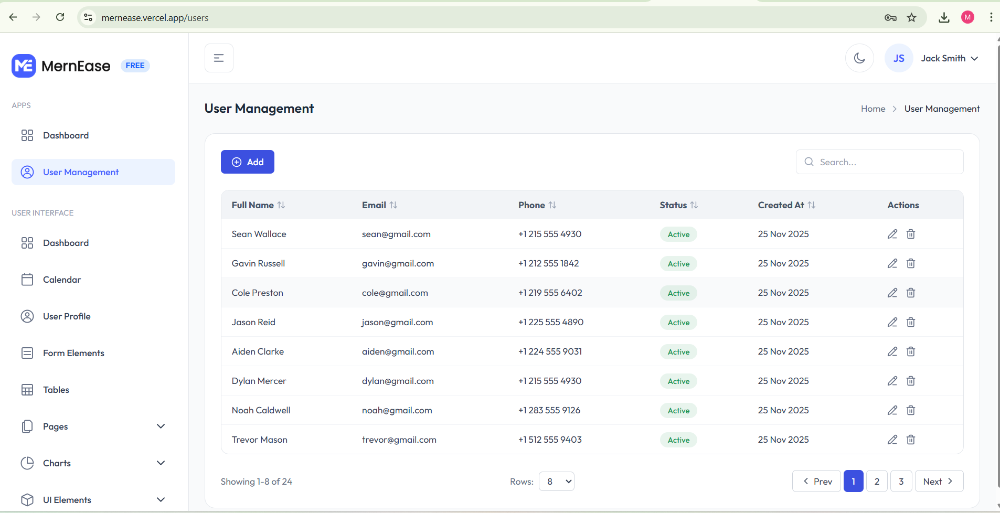

<p align="left">
  <a href="https://github.com/safytech/mernease/stargazers">
    
  </a>
  <a href="https://github.com/safytech/mernease/network/members">
    
  </a>
  <a href="https://github.com/safytech/mernease/blob/main/LICENSE">
    
  </a>
  
  <a href="https://mernease.vercel.app">
    
  </a>
</p>

## MERNEASE – Modern MERN Boilerplate (Free & Open Source)

A **production-ready MERN (MongoDB, Express, React, Node)** starter kit to help developers build full-stack apps faster. Includes **authentication**, **admin dashboard**, **reusable components**, **API structure**, and a clean developer workflow.

<p align="center">
  
  
  
</p>

---

## 🚀 Features
🔐 JWT Authentication  
🔁 Forgot / Reset Password  
🧩 Reusable UI Components  
📦 Modular API Structure  
📝 CRUD Operations  
🎨 Dashboard UI Layout  
🧠 Custom Hooks  
📁 Clean Folder Structure  
🌗 Dark & Light Mode Switch

---

## 🛠 Installation & ▶️ Run Locally

| Section | Installation Commands | Start Commands |
|--------|------------------------|----------------|
| **Client** | `cd client` <br> `npm install` | `npm run dev` |
| **Server** | `cd server` <br> `npm install` | `npm run start` |

---

## 🔑 Demo Credentials
```
Email: mernease@gmail.com
Password: 12345
```

---

## ⭐ Why MERNEASE?
- Saves **40–60 hours** of initial setup  
- Clean project structure  
- Beginner-friendly  
- Production-ready  
- Fully open-source  

---

## 🤝 Contributions
PRs and improvements are welcome!

---

## ⭐ Support the Project  
If MERNEASE helped you, consider giving the repo a **Star ⭐**.
